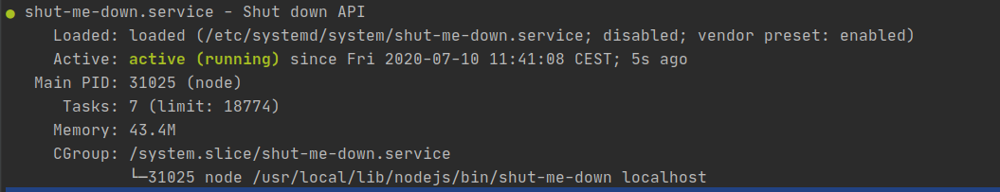

# SHUT-DOWN

Pending documentation

## Installing package

```shell script
npm i -g shut-me-down
```

*Important* depending on your OS, you need to allow commands to be used without sudo:
```shell script
# Run 'sudo visudo' and add 
your-username ALL=NOPASSWD: /sbin/shutdown       # OS X and Linux 
```

### CONFIGURATION

#### Configuring service under unix with systemd.

For this purpose we can use `systemctl` in order to set up a persistent service running on our machine.
You can do this with the following command:
```shell script
sudo nano /etc/systemd/system/shut-me-down.service
```
```shell script
## /etc/systemd/system/shut-me-down.service
[Unit]
Description=Shut down API
After=network.target
StartLimitIntervalSec=0
[Service]
Type=simple
Restart=always
RestartSec=1
User=username #1
ExecStart=/usr/local/lib/nodejs/bin/node /usr/local/lib/nodejs/bin/shut-me-down "127.0.0.1" #2 #3

[Install]
WantedBy=multi-user.target

# 1 Make sure that this field its changed for the username of your machine.
# 2 Be sure that your machine match this configuration, if you installed nodejs with node version manager probably won't.
# 3 You can limit where the service listen to the request, for example to limit to request coming from the local machine with localhost you can use 127.0.0.1, if this argument is not present 0.0.0.0 it's used by default, this means that the service will listen to any request coming from any internet interface.
```

Once you have created the `systemd` service you can run it with the following command
```shell script
## If you used a different name for the service file you need to use it here
sudo systemctl start shut-me-down.service
## Check the execution status
sudo systemctl status shut-me-down.service
```
The status should return an output like this:


If is not the case, and you get an error you will need to resolve the issues with the logs shown at the bottom of the status log or you can see the complete logs with the following command.
```shell script
sudo tail -n 40 -f /var/log/syslog 
```

If the service it's running succesfully you should be able to have the port 5709 open to your API, you can check it with the following command:
```shell script
sudo netstat -onatup | grep 5709
#tcp        0      0 0.0.0.0:5709            0.0.0.0:*               LISTEN      31025/node           off (0.00/0/0)
```

#### Configuring service on Windows 10
Its required to have installed nodejs in windows and administrator rights to enable the service.

The fist step is to install the package from npm, open powershell and install the package with the following command.
```shell
npm i -g shut-me-down
```

Now you need to create the service that will start automatically the shutdown API, for this you need a powershell session with admin rights, to do so, execute the following command, but make sure thar you update the path with the path of the binary in your case.
```shell
sc.exe create shutdownAPI binpath='C:/users/USERNAME/appdata/roaming/npm/shut-me-down.cmd' start= auto
```
For more information review [Microsoft documentation](https://docs.microsoft.com/en-us/windows-server/administration/windows-commands/sc-create)

You can review the service once the service is created you can check that the service is created, and review that is configured to automatically start with the system.

#### Windows known issues
If you try to start the service this will fail, but the service will be ready, try to call the shutdown command described in the ***Usage*** section and check if it works.
Improvements to the service process are required.

### USAGE
The application listens on the selected ip, and the port `5709`
You can test that the service woks by sending a `POST` to the url `http://your.choosen.ip:5709/halt`. If you want to test it from your terminal this command will help you:
```shell script
## Remember that you need to change the host for your the IP that requires your specific case, if the request comes from the same machine you cans use localhost.
## But if the request comes from other device you will ned to use the ip of the device running the service.

curl -d '' http://localhost:5709/halt ## This will power off your device if it's correctly configured.
```
